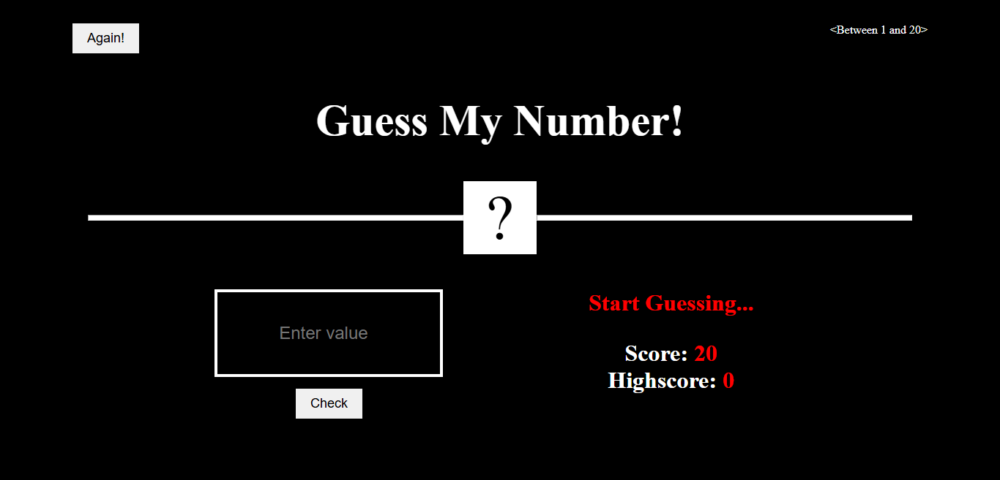

# Number Guessing Game



## Table of Contents
- [Project Description](#project-description)
- [Features](#features)
- [Technologies and Tools](#technologies-and-tools)
- [Implementation Steps](#implementation-steps)
- [Future Enhancements](#future-enhancements)
- [Getting Started](#getting-started)
- [Contributing](#contributing)
- [License](#license)

## Project Description
The Number Guessing Game is a simple and entertaining project that challenges players to guess a randomly generated number within a specified range. It's designed to provide users with a fun experience while enhancing their logical thinking and decision-making skills.

## Features
1. **User-Friendly Interface:** The game offers a clean and intuitive user interface with clear instructions and feedback.
2. **Random Number Generation:** A random number is generated within a defined range at the beginning of each round.
3. **Player Input:** Players can enter their guesses for the generated number.
4. **Feedback to Players:** After each guess, the game provides feedback indicating if the guess was too high or too low.
5. **Attempts Counter:** The game keeps track of the number of attempts made by the player.
6. **Winning Condition:** The game ends when the player correctly guesses the random number.
7. **Difficulty Levels:** Players can choose different difficulty levels that modify the range and allowed attempts.
8. **High Score Tracking:** Optionally, a high score system can be implemented to track the best scores.
9. **Play Again:** Players can start a new game after completing one.

## Technologies and Tools
- Programming Language: HTML, CSS & JS
- Integrated Development Environment (IDE): Visual Studio Code
- Version Control: Git
- User Interface (Optional): HTML/CSS for web-based games

## Implementation Steps
1. Define the game rules and objectives.
2. Choose the programming language and development environment.
3. Implement the random number generator within the specified range.
4. Create the user interface (if applicable).
5. Implement the game logic, including player input, feedback, and winning conditions.
6. Implement optional features like difficulty levels and high score tracking.
7. Test the game thoroughly to ensure it functions correctly.
8. Debug and refine the code as needed.
9. Document the project, including instructions for playing and any additional features.
10. Share the game with friends or publish it online (if desired).

## Future Enhancements
- Multiplayer mode: Allow multiple players to compete to guess the number within a time limit.
- Sound effects and animations to make the game more immersive.
- Integration with a user account system for online score tracking.
- Mobile app development to reach a wider audience.
- Localization for different languages.

## Getting Started
### Clone Repository
```bash
git clone https://github.com/nomshamas/number-guess-game.git
cd number-guess-game
```

## 🤝 Contributing
We welcome contributions to this project!
Please follow these steps:

### 1. Fork & Clone
```bash
1. git clone https://github.com/nomshamas/number-guess-game.git
2. cd number-guess-game
```
### 2. Create a New Branch
```bash
git checkout -b feature/your-feature-name
```
### 3. Make Changes & Commit
```bash
git add .
git commit -m "Add: your feature description"
```

### 4. Push & Create a Pull Request
```bash
git push origin feature/your-feature-name
```

### Then open a Pull Request on GitHub.


## 📌 Contribution Rules

- Write clear commit messages
- Follow the existing code style
- Update docs/tests if needed
- Be respectful in discussions

## 📜 License
This project is licensed under the MIT License.
You are free to use, modify, and distribute this software.

## 📧 Contact
Created by nomshamas — feel free to reach out!
